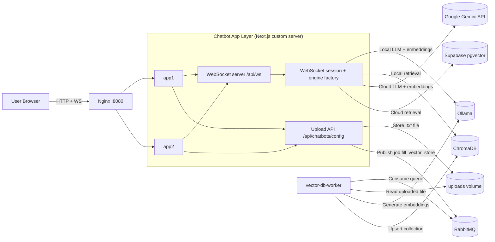
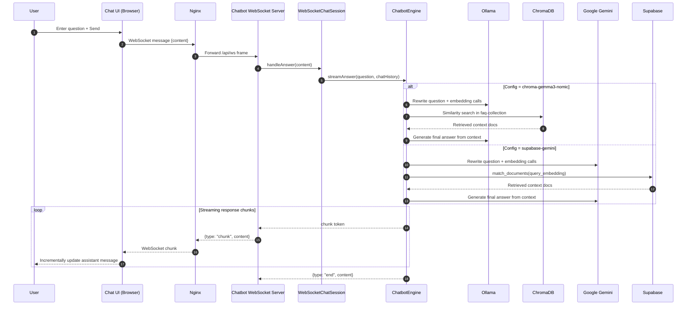

# Multi-Chain LangChain Chatbot

Next.js chatbot with runtime-selectable RAG engines, WebSocket streaming responses, and async local knowledge indexing through RabbitMQ.

## Current Setup

- Monorepo: Nx
- UI + API + WebSocket server: `apps/chatbot`
- Background worker: `apps/vector-db-worker`
- Infra services: ChromaDB, Ollama, RabbitMQ (via Docker Compose)
- Docker runtime entrypoint: Nginx load-balancing two chatbot app containers (`app1`, `app2`)

## Runtime Configurations

| Config ID | LLM | Embeddings | Vector Store |
| --- | --- | --- | --- |
| `supabase-gemini` | Google Gemini `gemini-2.5-flash-lite` | Google Gemini `gemini-embedding-001` | Supabase (`documents` + `match_documents`) |
| `chroma-gemma3-nomic` | Ollama `OLLAMA_CHAT_MODEL` (default `gemma3:1b`) | Ollama `nomic-embed-text:latest` | ChromaDB collection `faq-collection` |

## Component Diagram



Notes:
- In local development, you typically run one chatbot process (`npm run dev` or `npm run dev:all`) without Nginx.
- In Docker Compose full stack, traffic enters through Nginx and is distributed to `app1` and `app2`.

## Sequence Diagram (User Question Processing)



## Prerequisites

- Node.js 22+
- Docker + Docker Compose
- Supabase project (for cloud path)
- Google API key (for cloud path)

## Environment Variables

Create `.env` at repo root:

```env
# Required by current env schema
SUPABASE_URL=https://your-project.supabase.co
SUPABASE_API_KEY=your_supabase_api_key

# Required to enable/use cloud config (supabase-gemini)
GOOGLE_API_KEY=your_google_api_key

# Local infra defaults
CHROMA_HOST=localhost
CHROMA_PORT=8000
RABBITMQ_URL=amqp://localhost
OLLAMA_BASE_URL=http://localhost:11434
OLLAMA_CHAT_MODEL=gemma3:1b

# Optional tuning
SPLITTER_CHUNK_SIZE=1100
SPLITTER_CHUNK_OVERLAP=50
STORAGE_DIR=./uploads

# Needed when running production-mode app behind auth (e.g. docker compose full stack)
BASIC_AUTH_USER=admin
BASIC_AUTH_PASSWORD=change-me
```

## Local Development

1. Install dependencies:

```bash
npm install
```

2. Start infrastructure:

```bash
docker compose up -d chromadb rabbitmq ollama
```

3. Start app + worker:

```bash
npm run dev:all
```

Alternative:
- App only: `npm run dev`
- Worker only: `nx serve vector-db-worker`

Open `http://localhost:8080`.

## Knowledge Upload Pipeline

1. Open `/chatbot/upload`.
2. Upload a `.txt` file.
3. API route `POST /api/chatbots/config` writes the file to `uploads/` (or `STORAGE_DIR`).
4. API publishes `{"file":"<path>"}` to RabbitMQ queue `fill_vector_store`.
5. `vector-db-worker` consumes the job, chunks content, regenerates embeddings with Ollama, and rebuilds Chroma collection `faq-collection`.

## Supabase Setup (Cloud Path)

The cloud engine expects:
- Table name: `documents`
- RPC function name: `match_documents`

Use `pgvector` in your Supabase DB and create table/function names that match those identifiers.

## Docker Compose Full Stack

```bash
docker compose up --build
```

This starts:
- `nginx`
- `app1`, `app2`
- `worker`
- `chromadb`, `rabbitmq`, `ollama`

Access app at `http://localhost:8080`.

## Testing

Integration tests:

```bash
npm run test:integration
```

- Starts/warms infra in setup (`chromadb`, `rabbitmq`, `ollama`)
- Runs Jest integration specs
- Teardown kills/removes infra containers

E2E tests:

```bash
npm run test:e2e:setup
npm run test:e2e
```

- `test:e2e:setup` starts/warms infra
- `test:e2e` runs Playwright and auto-starts app web server (`npm run dev`)
- Playwright report output: `playwright-report/`
