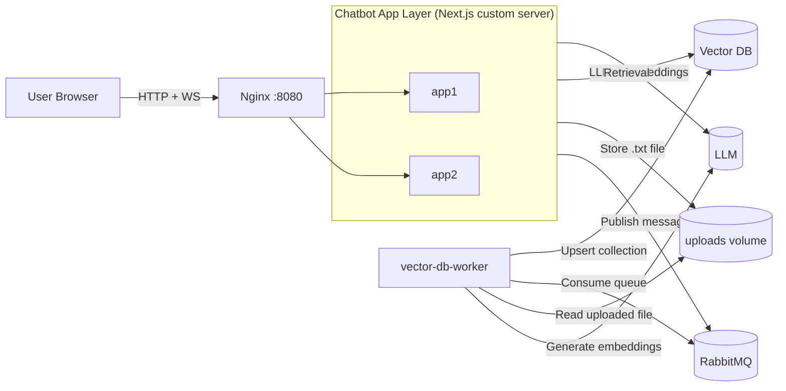
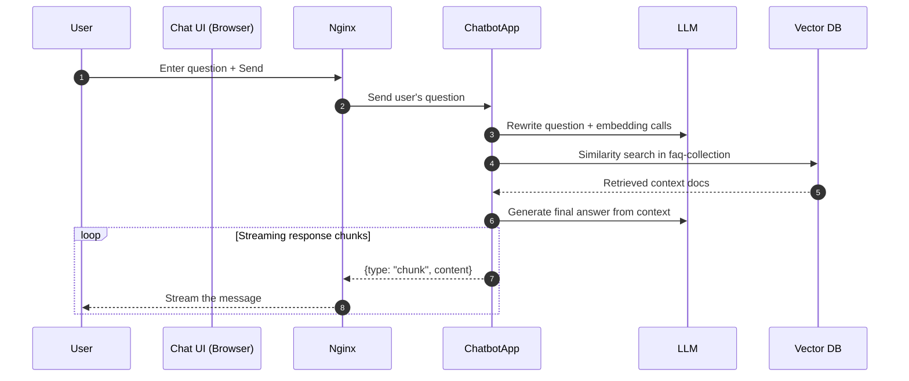
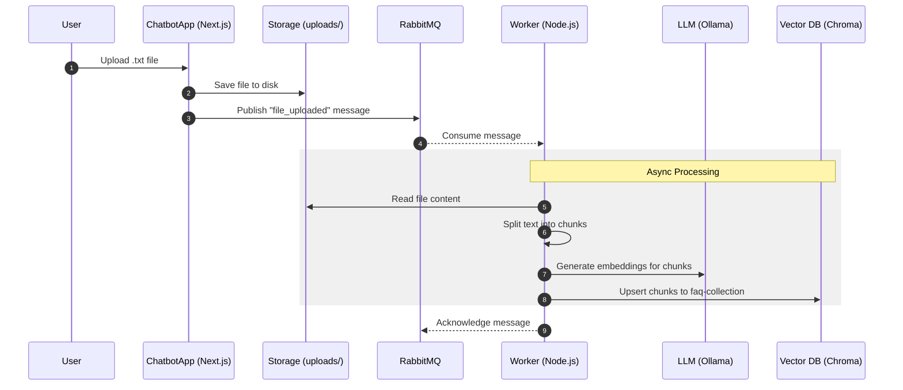

# Multi-Chain LangChain Chatbot

Next.js chatbot with runtime-selectable RAG engines, WebSocket streaming responses, and async local knowledge indexing through RabbitMQ. This main purpose of this app is learning and showcase.

## Current Setup

- Monorepo: Nx
- UI + API + WebSocket server: `apps/chatbot`
- Background worker: `apps/vector-db-worker`
- Infra services: ChromaDB, Ollama, RabbitMQ (via Docker Compose)
- Docker runtime entrypoint: Nginx load-balancing two chatbot app containers (`app1`, `app2`)
- Observability: OpenTelemetry Collector + Zipkin + Prometheus (via Docker Compose)

## Runtime Configurations

| Config ID             | LLM                                              | Embeddings                           | Vector Store                               |
| --------------------- | ------------------------------------------------ | ------------------------------------ | ------------------------------------------ |
| `supabase-gemini`     | Google Gemini `gemini-2.5-flash-lite`            | Google Gemini `gemini-embedding-001` | Supabase (`documents` + `match_documents`) |
| `chroma-gemma3-nomic` | Ollama `OLLAMA_CHAT_MODEL` (default `gemma3:1b`) | Ollama `nomic-embed-text:latest`     | ChromaDB collection `faq-collection`       |

## Component Diagram



Notes:

- In local development, you typically run one chatbot process (`npm run dev` or `npm run dev:all`) without Nginx.
- In Docker Compose full stack, traffic enters through Nginx and is distributed to `app1` and `app2`.

## Sequence Diagram (User Question Processing)



## Sequence Diagram (Knowledge Upload & Indexing)



## Prerequisites

- Node.js 22+
- Docker + Docker Compose
- Supabase project (for cloud path)
- Google API key (for cloud path)

## Environment Variables

Create `.env` at repo root:

```env
# Required by current env schema
SUPABASE_URL=https://your-project.supabase.co
SUPABASE_API_KEY=your_supabase_api_key

# Required to enable/use cloud config (supabase-gemini)
GOOGLE_API_KEY=your_google_api_key

# Local infra defaults
CHROMA_HOST=localhost
CHROMA_PORT=8000
RABBITMQ_URL=amqp://localhost
OLLAMA_BASE_URL=http://localhost:11434
OLLAMA_CHAT_MODEL=gemma3:1b

# Optional tuning
SPLITTER_CHUNK_SIZE=1100
SPLITTER_CHUNK_OVERLAP=50
STORAGE_DIR=./uploads

# Needed when running production-mode app behind auth (e.g. docker compose full stack)
BASIC_AUTH_USER=admin
BASIC_AUTH_PASSWORD=change-me
```

## Local Development

1. Install dependencies:

```bash
npm install
```

2. Start infrastructure:

```bash
docker compose up -d chromadb rabbitmq ollama otel-collector zipkin
```

3. Start app + worker:

```bash
npm run dev:all
```

Alternative:

- App only: `npm run dev`
- Worker only: `nx serve vector-db-worker`

Open `http://localhost:8080`.

## Knowledge Upload Pipeline

1. Open `/chatbot/upload`.
2. Upload a `.txt` file.
3. API route `POST /api/chatbots/config` writes the file to `uploads/` (or `STORAGE_DIR`).
4. API publishes `{"file":"<path>"}` to RabbitMQ queue `fill_vector_store`.
5. `vector-db-worker` consumes the job, chunks content, regenerates embeddings with Ollama, and rebuilds Chroma collection `faq-collection`.

## Supabase Setup (Cloud Path)

The cloud engine expects:

- Table name: `documents`
- RPC function name: `match_documents`

Use `pgvector` in your Supabase DB and create table/function names that match those identifiers.

## Docker Compose Full Stack

```bash
docker compose up --build
```

This starts:

- `nginx`
- `app1`, `app2`
- `worker`
- `chromadb`, `rabbitmq`, `ollama`
- `otel-collector`, `zipkin`, `prometheus`

Access app at `http://localhost:8080`.

## Observability

The stack ships with an [OpenTelemetry Collector](https://opentelemetry.io/docs/collector/), [Zipkin](https://zipkin.io/), and [Prometheus](https://prometheus.io/) for traces and metrics.

### How it works

The chatbot app (`apps/chatbot`) is instrumented via `@vercel/otel` (see `apps/chatbot/instrumentation.ts`), which registers the service as `langchain-chatbot-app` and exports telemetry using the OTLP protocol.

```
Chatbot App  ──OTLP──▶  otel-collector  ──▶  Zipkin (traces)
                                        ├──▶  Prometheus exporter (:12345)
                                        └──▶  debug exporter (stdout)
Prometheus  ──scrape──▶ otel-collector (:8888, :12345)
```

### OTel Collector (`otel-collector-config.yaml`)

The collector is configured with:

| Component            | Details                                                                 |
| -------------------- | ----------------------------------------------------------------------- |
| **Receiver**         | OTLP over gRPC (`0.0.0.0:4317`) and HTTP (`0.0.0.0:4318`)               |
| **Traces exporter**  | Zipkin (`http://zipkin:9411/api/v2/spans`, proto format) + debug stdout |
| **Metrics exporter** | Prometheus (`0.0.0.0:12345`) + debug stdout                             |
| **Logs exporter**    | debug stdout                                                            |

#### Exposed ports

| Port    | Purpose                                            |
| ------- | -------------------------------------------------- |
| `4317`  | OTLP gRPC receiver (apps send traces here)         |
| `4318`  | OTLP HTTP receiver                                 |
| `8888`  | Prometheus metrics exposed by the Collector itself |
| `12345` | Prometheus metrics from OTLP + spanmetrics pipeline |
| `13133` | Health check extension                             |
| `1888`  | pprof extension                                    |
| `55679` | zPages extension                                   |

### Zipkin

Zipkin stores and visualises the distributed traces forwarded by the OTel Collector.

- **UI:** [http://localhost:9411](http://localhost:9411)
- **Service name in traces:** `langchain-chatbot-app`

### Prometheus

Prometheus scrapes the collector and stores metrics generated by the telemetry pipelines.

- **UI:** [http://localhost:9090](http://localhost:9090)
- **Scrape targets:** `otel-collector:8888` (collector internal metrics) and `otel-collector:12345` (pipeline/app metrics)
- **Quick check query:** `up{job="otel-collector"}`

### Viewing traces and metrics locally

1. Start the observability infra alongside the other services:

   ```bash
   docker compose up -d otel-collector zipkin prometheus
   ```

2. Run the app (`npm run dev:all` or `docker compose up --build`).
3. Open [http://localhost:9411](http://localhost:9411) in your browser.
4. Select service `langchain-chatbot-app` and click **Find Traces**.
5. Open [http://localhost:9090](http://localhost:9090) and run `up{job="otel-collector"}` to confirm metric scraping.

## Testing

Integration tests:

```bash
npm run test:integration
```

- Starts/warms infra in setup (`chromadb`, `rabbitmq`, `ollama`)
- Runs Jest integration specs
- Teardown kills/removes infra containers

E2E tests:

```bash
npm run test:e2e:setup
npm run test:e2e
```

- `test:e2e:setup` starts/warms infra
- `test:e2e` runs Playwright and auto-starts app web server (`npm run dev`)
- Playwright report output: `playwright-report/`

## FAQ

Q: Why the Docker image for chatbot app is so large?

A: The problem is with next.js being bundled with all the dependencies. I tried to reduce the size by using standalone output, but it doesn't work as we are using custom server for websocket. The custom server is not part of the standalone output and needs to have all the deps. I did not find a way to fix the build.
